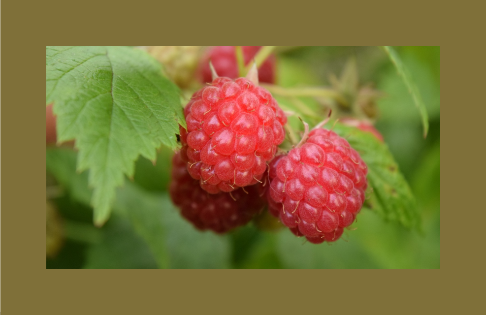
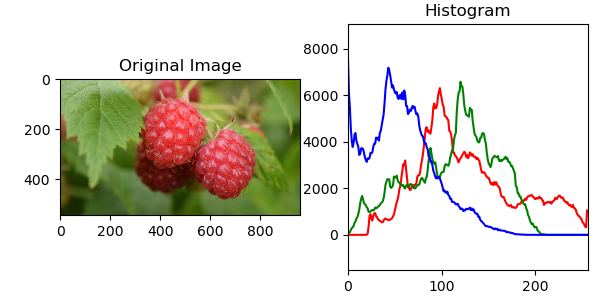
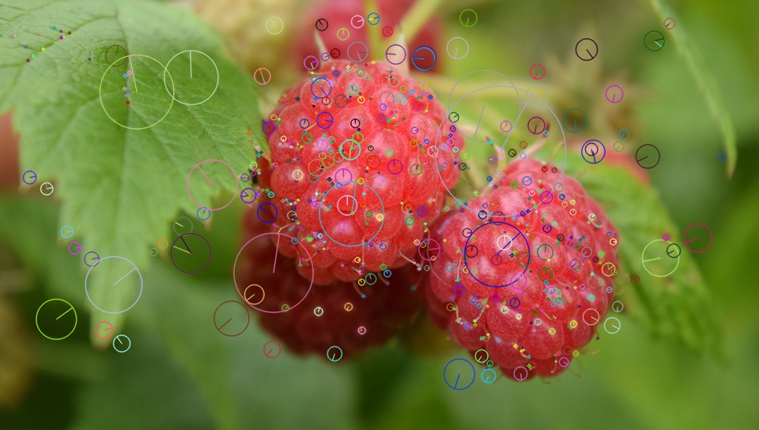
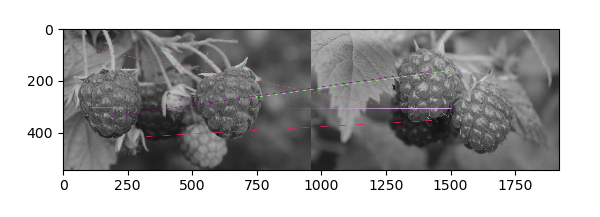

<h2 align="center">
    Image processing - Search Engine for images
</h2>

#### Summary

***

Based on a query image using **[OPEN CV](https://docs.opencv.org/4.1.2/d6/d00/tutorial_py_root.html)**, the system searches within its database (using different methods) for identical or most similar images, to return them and show them to the user.


#### RGB Mean
It consists of extracting the average value of the three channels in the image.
Compare the average *RGB value* of the query image with each of the images in the database using Euclidean distance.

<p align="center">
  
</p>

```python
img = cv.imread('Database/Fruit23.jpg’)
r,g,b = Average_color( img )
print("Mean RGB of Image ->", r,g,b)

# Leer archivo .xlsx con los valores promedio rgb de cada imagen    reader = pd.read_excel(name_file + '.xlsx’)
m_RED = reader['RED’]
m_GREEN = reader['GREEN’]
m_BLUE = reader['BLUE']
dist = sqrt( pow( r - int(m_RED[0]), 2)  + pow( g - int(m_GREEN[0]), 2) + pow( b - int(m_BLUE[0]), 2) ) 
distlist =[ float(dist.real) ] 

for i in range(1, len(reader), 1):
        dist = sqrt( pow( r - int(m_RED[i]), 2)  + pow( g - int(m_GREEN[i]), 2) + pow( b - int(m_BLUE[i]), 2) ) 
        distlist.append( float(dist.real) )

reader['Distance'] = distlist
reader = reader.sort_values('Distance’)
print(reader)
listpaths = reader['Path'].values.tolist()
plimg = []

#cv.imshow("Original File", img)   

for j in range(0,20,1):
        aux = ( cv.imread( str(listpaths[j]) ) )
        plb, plg, plr = cv.split(aux) 
        plimg.append( cv.merge([plr,plg,plb]) ) 

fig=plt.figure(figsize=(10, 8))
for n in range(1, 21,1):
        fig.add_subplot(4, 5, n)
        plt.imshow( plimg[n-1] )

plt.show()   
cv.waitKey()

```

#### Color Histograms

It consists of extracting a three-dimensional histogram that represents the color distribution of the image.
The N values of the histogram of the query image are compared with the images in the database using the Manhattan distance.

<p align="center">
  
</p>

``` python
# Función para leer los archivos de un directorio.
def ImagesList(direccion = getcwd()):
        return [arch.name for arch in scandir(direccion) if arch.is_file()]
# Dirección de la carpeta para enlistar archivos.
dir_images = 'Database'
# Obtención de la lista de archivos.
listfiles = ImagesList(dir_images)
# -> Lectura de la imagen principal a comparar.
img = cv.imread('Database/Fruit23.jpg’)
hist = cv.calcHist( [img], [0, 1, 2], None, [8 ,8, 8], [0, 256, 0, 256, 0, 256] )
hist = cv.normalize(hist, hist, 1.0, 0, cv.NORM_L1).flatten()
data = pd.DataFrame()
data['Path'] = listfiles 
datalist = [ ] # Inicializar una lista.

ManhattanDist = [ ]
EuclideanDist = [ ]

for i in range(0 , len(listfiles), 1):
        img_aux = cv.imread( dir_images + '\\' + str( listfiles[i] ))    hist_aux = cv.calcHist( [img_aux], [0, 1, 2], None, [8 ,8, 8], [0, 256, 0, 256, 0, 256] )
        hist_aux = cv.normalize(hist_aux, hist_aux, 1.0, 0, cv.NORM_L1).flatten()

        datalist.append( cv.compareHist(hist, hist_aux, cv.HISTCMP_HELLINGER) ) 
        ManhattanDist.append( distance.cityblock( hist, hist_aux))
        EuclideanDist.append( distance.euclidean(hist, hist_aux) )
    
data['Bhattacharyya'] = datalist
data['Manhattan distance'] = ManhattanDist
data['Euclidean distance'] = EuclideanDist

data = data.sort_values('Manhattan distance’)
listfiles = data['Path'].values.tolist()
plimg = []

for j in range(0,20,1):
        aux = ( cv.imread( str(dir_images)+'//'+str(listfiles[j]) ) )    plb, plg, plr = cv.split(aux) 
        plimg.append( cv.merge([plr,plg,plb]) ) 

fig=plt.figure(figsize=(10, 8))
for n in range(1, 21,1):
        fig.add_subplot(4, 5, n)
        plt.imshow( plimg[n-1] )

```

#### SIFT Descriptors

It consists of extracting the points of interest and their descriptors using the SIFT method from the query image, to subsequently compare each of the descriptors with each descriptor of each of the images in the database.

<p align="center">
  
</p>

<p align="center">
  
</p>

``` python

# Función para leer los archivos de un directorio.
def ImagesList(direccion = getcwd()):
        return [arch.name for arch in scandir(direccion) if arch.is_file()]

# Dirección de la carpeta para enlistar archivos.
dir_images = 'Database'

# Obtención de la lista de archivos.
listfiles = ImagesList(dir_images)
img = cv.imread('Database/CASA11.jpg’)
imggray = cv.cvtColor(img,cv.COLOR_BGR2GRAY)

sift = cv.xfeatures2d.SIFT_create() # Crear la clase SIFT para extraer descriptores.
bf = cv.BFMatcher()
kp , des = sift.detectAndCompute( img, None )

imgdist = []
for i in range(0 , len(listfiles) ): #len(listfiles)
    imgaux = cv.imread( str(dir_images) + '\\' + str( listfiles[i] )  )    kpaux , desaux = sift.detectAndCompute( imgaux , None ) 
        matches = bf.knnMatch(des,desaux, k=2)
        good = [] # Lista de las mejores coincidencias entre dos imágenes.
        dist = 0
           for m,n in matches:
                   if m.distance < 0.75*n.distance:
                                good.append([m])
                                dist = m.distance + dist
            try:
                    da = dist/len(good)
            except ZeroDivisionError:
                        da = Infinity 
   
            imgdist.append( da )

df = pd.DataFrame()
df["Files"] = listfiles
df["Dist"] = imgdist

print(listfiles)

df = df.sort_values("Dist")
listfiles = df["Files"].tolist()
print(listfiles)


```
